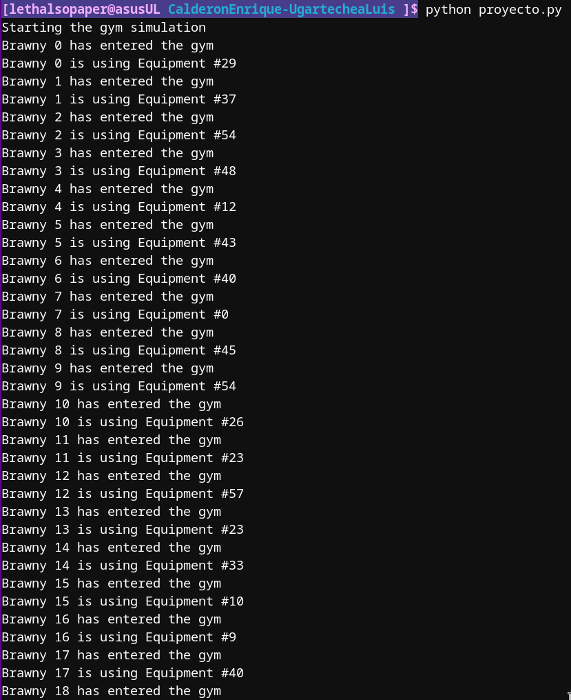

# Proyecto de administración de procesos

Autores: Enrique Calderón & Luis Ugartechea

## Descripción del problema

Todos sabemos que el gimnasio es un lugar divertido, por lo mismo, a mucha gente le gusta ir. En Ciudad Universitaria existen varios gimnasios pero todos sabemos que el mejor es el de la alberca. Desafortunadamente no es solo para ingenieros, también van algunos estudiantes de otras facultades como química, derecho o medicina y uno que otro de preparatoriano perdido.

El problema es que el gimnasio tiene un aforo limitado pues solo se cuentan con 60 equipos de ejercicio. El aforo máximo son 180 pues en cada equipo puede haber hasta 3 personas alternando. Si llegan más personas al gimnasio se les indica que esta lleno y se van al LIDSoL a pasar el rato en lo que se libera.

Cuando vamos al gimnasio cada uno tiene una rutina para cada día por lo que solo llegas a usar de 6 a 10 equipos por sesión.

Para este proyecto modelaremos este sistema. Recordando que:

-   Son 60 equipos de ejercicio en total.
-   Cada persona llega en momentos aleatorios del tiempo al gimnasio, pero si no hay espacio en el gimnasio se retira y vuelve mas tarde.
-   Cada persona ocupa de 6 a 10 equipos por sesión, sin preferencia en el orden, solo buscan perder el menos tiempo posible por lo que buscan equipos libres o donde puedan alternar.
-   Como en el gimnasio son tímidos, nadie alterna con más de 3 personas a la vez.
-   Si no esta libre alguno de los aparatos restantes, se puede ir si ya hicieron ejercicio con al menos 5 equipos.

Si no se controla el acceso al gimnasio puede saturarse y no sé podrá dar abasto, provocaría conflictos entre los usuarios por el uso del equipo ya que es molesto cuando tenemos que alternar el equipo entre más de 3 personas que no tienen el mismo ritmo de ejercicio.

La idea es controlar el acceso para mejorar la comodidad de los usuarios y evitar conflictos entre ellos.

## Descripción de los mecanismos de sincronización empleados

Para modelar y resolver el problema vimos la posibilidad de seguir una idea similar a la del problema de gatos y ratones, esto pues en primer lugar necesitábamos limitar la entrada al gimnasio y después controlar el uso de los equipos. Para esto hicimos uso de variables contador protegidas por mutex. Estos combos contador-mutex, por lo tanto, son variables globales.

El algoritmo de cada hilo es el siguiente:

1. Verificar si el gimnasio cuenta con espacio, si no, esperar (yendo al LIDSoL) y volver a intentar hasta que haya espacio.
2. Al entrar al gimnasio verificar, en orden, los equipos que necesita para entrenar. Si alguno esta libre (con menos de 3 personas) va y lo ocupa, si no, sigue buscando. En caso de que ya haya ocupado 5 equipos, si no encuentra alguno libre se retira pues considera que ya hizo suficiente ejercicio.
3. Al terminar de entrenar, se retiro del gimnasio.

Los threads interactúan entre si por medio de mutex y variables de condición. Los mutex son utilizados para proteger el acceso a las variables globales que representan el estado del gimnasio y los equipos. Se toma el mutex para verificar las cantidades y se libera tanto si se modificó como si solo se leyó. Esto nos asegura integridad en el acceso a las variables. Se sigue el mismo principio tanto con el acceso al gimnasio en si como con el uso de cada equipo.

## Descripción del entorno de desarrollo, suficiente para reproducir una ejecución exitosa

Para el desarrollo del proyecto utilizamos la versión 3.13.2 de Python bajo la distribución de GNU/Linux Fedora 41. No utilizamos ninguna biblioteca adicional a las estándar de Python exceptuando el uso de Tkinter para la interfaz gráfica. La última versión de Tkinter.

Estas decisiones fueron tomadas pues consideramos que Python nos permite un desarrollo más rápido, además de ser ampliamente utilizado. En cuestión de la interfaz gráfica, Tkinter es un excelente combo junto con Python, pues es fácil de usar y no requiere de instalación adicional. No solo eso, ya contábamos con experiencia previa en su uso.

## Ejecución

Dentro del directorio `proyectos/1/CalderonEnrique-UgartecheaLuis` se encuentra el archivo `proyecto.py` que contiene la implementación del programa. Para ejecutarlo se ejecuta siguiente comando:

```bash
python proyecto.py
```

Algunas capturas de la interfaz gráfica son las siguientes:


